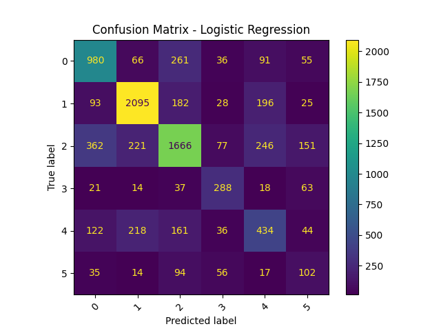
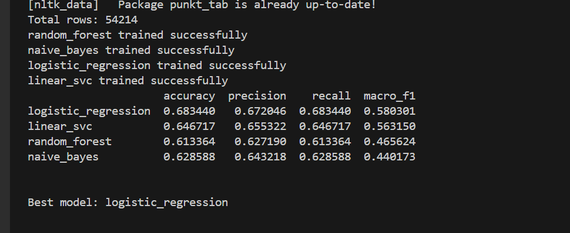

# 🎬 Movie Genre Classification

A Machine Learning project that predicts the genre of a movie based on its plot summary using natural language processing techniques.

🔗 **Dataset:** https://www.kaggle.com/datasets/hijest/genre-classification-dataset-imdb

---

## 🧠 Project Overview

This project demonstrates how to build a text classification model that predicts movie genres from their plot descriptions. It explores classical NLP techniques like TF-IDF feature extraction with multiple machine learning classifiers—to understand performance, limitations, and real-world applicability.

---

## 📋 Problem Statement

Given a movie plot summary or description, build a machine learning model that can predict its genre. The model should handle multi-class classification and be evaluated responsibly using appropriate metrics.

---

## 🗂️ Dataset

This project uses the **IMDB Genre Classification Dataset** from Kaggle, which consists of more than **54,000 movie plot summaries** along with their corresponding genres.

📌 You can access the dataset here:  
👉 https://www.kaggle.com/datasets/hijest/genre-classification-dataset-imdb

Each row contains:
- Movie ID  
- Movie Name  
- Genre  
- Plot summary

---

## 🧪 Methodology

### 1. Data Preprocessing
- Lowercasing
- Removing punctuation and stopwords
- Lemmatization
- Train/test split (stratified)

### 2. Feature Engineering
Used **TF-IDF Vectorizer** to convert text into numeric features.

Example settings used:
```python
TfidfVectorizer(
    max_features=10000,
    ngram_range=(1,2),
    min_df=3,
    max_df=0.95,
    sublinear_tf=True
)

## 📊 Model Output

Below is the evaluation output including metrics and confusion matrix:
## Confusion Matrix


## Class-wise F1 Scores

